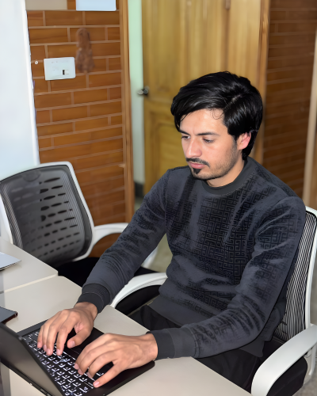

# 🚀 Modern MERN Stack Portfolio

Hi! I'm **Saifullah Bangash**, a passionate MERN Stack Developer. This is my professional portfolio website, built for speed, responsiveness, and a premium user experience.


## 📸 Preview
 
*(Tip: Aap apni puri website ka screenshot 'src/assets/img/' folder mein save karein aur uska naam yahan update kar dein)*

---

## 🛠️ Technologies Used

| Category | Tools & Tech |
| :--- | :--- |
| **Frontend** | React.js, Tailwind CSS, Framer Motion |
| **Backend** | Node.js, Express.js |
| **Database** | MongoDB |
| **Icons** | Lucide-react, React Icons |
| **Animation** | Framer Motion (Scroll Animations) |
| **Deployment** | Vercel / GitHub Pages |

---

## ✨ Key Features

- 📱 **Fully Responsive:** Optimized for Mobile, Tablet, and Desktop.
- 🌓 **Modern Design:** Clean UI with a professional color palette.
- ⚡ **Performance:** Built with Vite for ultra-fast loading speeds.
- 🎭 **Smooth Animations:** Interactive elements using Framer Motion.
- 📩 **Working Contact Form:** Easy way for clients to reach out.
- 📜 **Timeline:** Detailed Education and Experience sections.

---

## 🚀 Getting Started

Follow these steps to run the project locally:

1. **Clone the repository:**
   ```bash
   git clone [https://github.com/Saif-Bangash/portfolio.git](https://github.com/Saif-Bangash/portfolio.git)